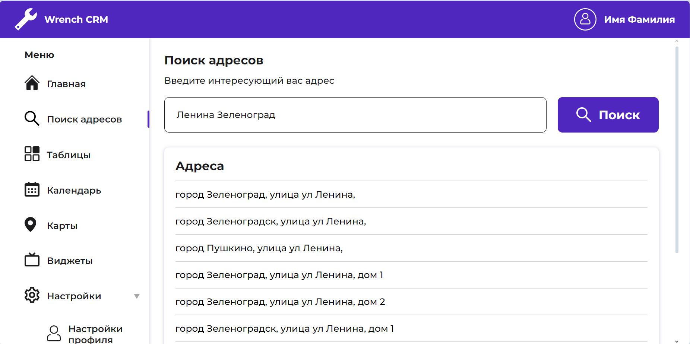

# Wrench CRM
CRM control panel: displays addresses entered by the user on the page and displays news on the main page.

`ReactJS` `TypeScript` `Sass`

# Preview 
Try It - https://crm-wrench.vercel.app
<p align="center">
  
</p>

# How to install 
1. Clone the repository:
```cmd
YourFolderName > git clone git@github.com:AKarpenka/wrench_crm.git
```

2. Install npm packages:
```cmd
wrench_crm > npm i
```

# How to run 
```cmd
wrench_crm > npm run start
```
